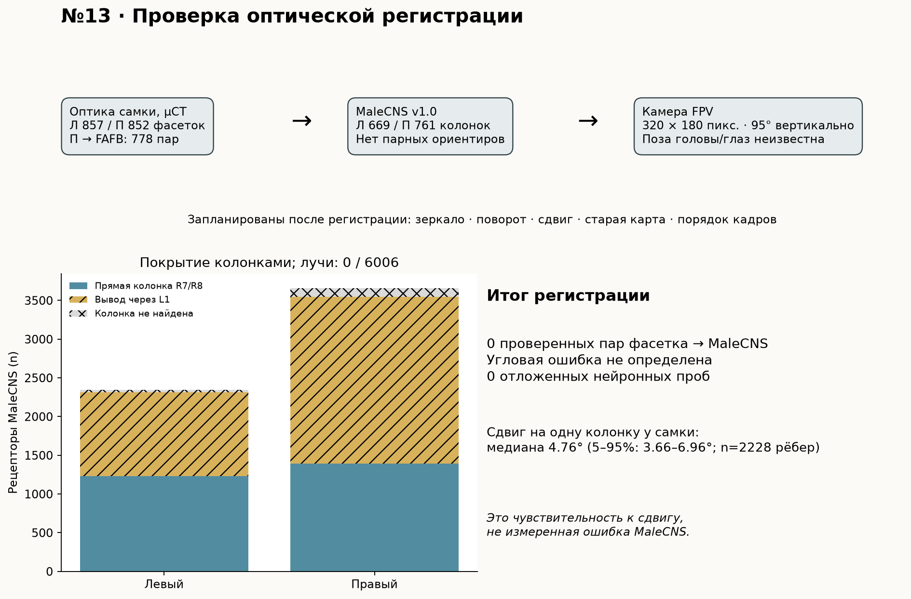

# Issue #13: аудит переноса оптической карты на MaleCNS v1.0

**Итог: однозначная оптическая регистрация не подтверждена.** Открытые направления фасеток самки и код её сопоставления с FAFB найдены, но в доступной таблице колонок MaleCNS v1.0 нет измеренных лучей, соответствий отдельным фасеткам, экватора и центрального меридиана, по которым авторы привязали глаз к *другому* коннектому. Дорсальная область (`DRA`) размечена, но одной этой метки недостаточно для определения всех пар «фасетка → колонка» и ориентации головы относительно FPV-камеры. Поэтому каждому из 6006 рецепторов оставлен статус `unregistered`; угловая ошибка регистрации, периферическая неопределённость и нейронное превосходство новой карты **не измерялись**. Это результат первого, заранее указанного в issue, шлюза переносимости, а не отрицательный физиологический результат.



[Векторная инфографика](infographic.svg) · [данные](results.json) · [полная таблица 6006 рецепторов](receptor_audit.csv) · [код анализа и рисунка](../../scripts/audit_optical_map.py)

## Первичные источники и разрешения

| Источник | Что в нём установлено | Граница использования |
| --- | --- | --- |
| [Zhao, Gruntman et al., *Nature* 2025](https://www.nature.com/articles/s41586-025-09276-5), [авторские данные и код](https://github.com/reiserlab/eyemap_T4/tree/99d2a43123db636cedb55af9ff31a59657e7d17e) | µCT целых голов самок, направление фасетки от кончика фоторецепторов к линзе; сопоставление правого глаза с медуллой FAFB по экватору и центральному меридиану. Авторы отдельно отмечают расхождение разных особей на границе глаза. | Это не измерение головы данного самца MaleCNS и не таблица его body ID. Код и файлы в репозитории автора опубликованы под [GPL-3.0](https://github.com/reiserlab/eyemap_T4/blob/99d2a43123db636cedb55af9ff31a59657e7d17e/LICENSE); исходные файлы здесь не перепубликованы. |
| [Berg et al., таблица колонок MaleCNS v1.0](https://github.com/flyconnectome/2025malecns/blob/67767d2233657983993ff6c2be48e836a935863c/README.md#optic-lobe-column-assignment), [портал релиза](https://male-cns.janelia.org/download/) | Два листа колонок, идентификаторы L1/R7/R8, тип и маркеры ветвей. На портале указан `male-cns:v1.0` и [CC-BY для коннектома](https://male-cns.janelia.org/download/). | Нет столбца с оптическим лучом или парой с µCT-фасеткой. `DRA` задаёт участок, но не полный экватор/меридиан и не угол каждого рецептора. |
| [Координаты колонок](https://github.com/reiserlab/male-drosophila-visual-system-connectome-code/blob/main/docs/coordinate-systems.md) и [документация камер MuJoCo](https://mujoco.readthedocs.io/en/3.6.0/modeling.html#cameras) | Шестигранные индексы описывают соседство колонок; камера смотрит вдоль отрицательной оси Z, X/Y направлены вправо/вверх в кадре. | Ни одна из этих систем координат сама по себе не даёт поворота между глазом самца и камерой квадрокоптера. |

Версии и SHA-256 внешних входов сохранены в [results.json](results.json): `eyemap_T4` commit `99d2a43123db636cedb55af9ff31a59657e7d17e`; `20240701.RData` — `8408447f8c5798fbc6d751de79ef4983d08c342a500c9a55b2a3b4b38d92deec`; `eyemap.RData` — `c3f63c69afdc3f381cdafabb1d376b8e25ec5a71bce67550ae42fcdd79cf618e`; MaleCNS workbook из commit `67767d2233657983993ff6c2be48e836a935863c` — `d4af1cacb751036f7e84bfecc9bec79ca010066ac066559c29b566003ec080d3`. Код проверки сверяет также хеши `brain.npz`, `weights.npz`, ранее сохранённой `map.npz` и двух файлов обработки авторов. Локальные RData загружаются в `data/flybrain/raw/eyemap-t4/` и исключены из Git.

## Измерения доступных данных

| Набор / сторона | Колонки или фасетки (n) | Уточнение |
| --- | ---: | --- |
| µCT самки, левый глаз | 857 фасеток | Доступны в `20240701.RData`; опубликованная пара с FAFB здесь не используется. |
| µCT самки, правый глаз | 852 фасетки | `lens_ixy` содержит 852 индекса решётки; в `eyemap.RData` — 778 пар с FAFB. |
| Таблица MaleCNS, левый глаз | 880 колонок | В том числе 40 `DRA`; 669 различных колонок встретились у рецепторов локальной модели. |
| Таблица MaleCNS, правый глаз | 892 колонки | В том числе 42 `DRA`; 761 различных колонок встретилась у рецепторов локальной модели. |
| Локальная модель, левый глаз | 2345 рецепторов | 1233 R7/R8 получили прямую колонку, 1084 R1–R6 — выведенную по L1; 28 без колонки. |
| Локальная модель, правый глаз | 3661 рецептор | 1395 прямых, 2153 выведенных; 113 без колонки. |

Последние две строки воспроизводят [карту issue #1](../retina-2d/map.json), а не новые оптические соответствия. Происхождение **каждого** рецептора и пустые поля `female_lens_id`, `angular_residual_deg` записаны в [receptor_audit.csv](receptor_audit.csv). Из 6006 рецепторов 5865 имеют старую топологическую координату, 141 не имеют и её, 0 получили обоснованный оптический луч. Разница количества колонок и фасеток сама по себе не опровергает регистрацию, но исключает простое присвоение по равному порядковому индексу.

[Авторский код регистрации](https://github.com/reiserlab/eyemap_T4/blob/99d2a43123db636cedb55af9ff31a59657e7d17e/proc_eyemap.R) использует выбранные для его образцов опорные индексы Mi1 и линз, а затем связывает позиции двух решёток. [Код µCT](https://github.com/reiserlab/eyemap_T4/blob/99d2a43123db636cedb55af9ff31a59657e7d17e/proc_uCT.R) обрабатывает оба глаза, но опубликованная пара с FAFB здесь построена для правого. Копирование чисел опорных индексов в MaleCNS означало бы подмену особи и идентификаторов. Портал MaleCNS предоставляет [морфологические преобразования в общий шаблон](https://male-cns.janelia.org/download/), но один шаблон не устанавливает измеренный луч отсутствующей в EM голове фасетки и не калибрует позу камеры квадрокоптера.

В правом глазу самки 2228 пар соседних **уже сопоставленных с FAFB** лучей имеют расстояние по сфере: медиана **4,756°**, 5-й–95-й процентили **3,661–6,961°**. Это масштаб последствий сдвига на одну колонку *в опубликованном образце*, а **не оценка ошибки переноса в MaleCNS**. Без общих ориентиров остаток угловой регистрации и его изменение на периферии численно неопределимы.

## Системы координат и прекращённый перенос

Существующий код `normalized_eye_coordinates` превращает `hex1=q`, `hex2=p` в `x=q−p`, `y=−(q+p)` и отдельно нормирует каждый глаз к `[0,1]²`. Это выбранная проекция для синтетического входа. Оптическое значение у неё отсутствует; зеркальность относительно камеры и угол на колонку не заданы.

Из [XML модели](../../assets/fpv_quad.xml) известна камера в системе квадрокоптера: позиция `(0.102, 0, 0.045)` м, ось вправо `(0,−1,0)`, вверх `(0,0,1)`, вперёд `(1,0,0)`. Для кадра **320×180 пикселей** вертикальный FOV **95°** даёт фокус `f=H/[2 tan(95°/2)] = 82,470` пикселя и горизонтальный FOV **125,464°**. Нормированный луч центра пикселя `(u,v)` в системе квадрокоптера:

```text
ray_quad(u,v) = normalize(1, −(u−W/2)/f, (H/2−v)/f)
```

Для требуемого следующего шага нужны (1) обоснованное сопоставление `MaleCNS колонка ↔ фасетка самки` с ориентирами и оценкой расхождения между особями, и (2) преобразование `quad → голова/глаз`, включая сторону и позу. Из проверенных источников ни один из этих двух операторов не определён. Подстановка только луча камеры создала бы точную цифру для произвольной биологической регистрации.

## Контроли, отложенная проверка и вывод

Предусмотренные в issue зеркало стороны, повороты/сдвиги решётки, прежняя 2D карта, статичные и обращённые кадры, новые положения/направления/скорости/контрасты/фазы/периоды/зерна и отдельное считывание T4/T5 **не запускались**: основной вариант «измеренный луч → MaleCNS» не определён. Сравнение с физиологией или FPV-контроллером на этом основании также было бы неинтерпретируемым. Исторические спайковые и полётные результаты остаются в [отчёте 2D карты](../retina-2d/report.md) и [сводке](../../docs/research-results.md).

Вывод по issue #13: **первая ступень гипотезы не пройдена для доступных источников**. Геометрического выигрыша и нейронной настройки у MaleCNS не проверено; FPV-повтор для #2 не разрешён этим аудитом. Новый опыт потребовал бы измеренного мужского глаза с фиксированными оптическими ориентирами MaleCNS или независимо проверенных пар колонок и фасеток, затем отдельной проверки регистрационных остатков и заранее назначенного нейронного протокола.

## Воспроизведение

После установки `.[research]` и получения локальных файлов `data/flybrain/brain.npz`, `weights.npz`, `raw/optic-columns.xlsx` прежним протоколом:

```sh
FLY_DATA="$PWD/data/flybrain" .venv/bin/python scripts/audit_optical_map.py --fetch
.venv/bin/python -m unittest discover -s tests -v
```

`--fetch` скачивает четыре закреплённых файла авторов, сверяет SHA-256 и строит JSON, CSV и обе версии инфографики. Повторный запуск возможен без сети, без `--fetch`. Скрипт останавливается при изменении любого закреплённого входа.
