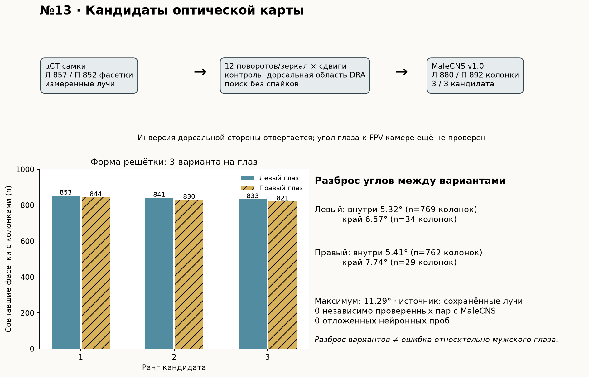

# Issue #13: аудит переноса оптической карты на MaleCNS v1.0

**Итог: построены три правдоподобных совмещения для каждого глаза, но оптическая карта ещё не валидирована.** Мы перебрали повороты, отражения и сдвиги шестигранных решёток. Лучшее совмещение покрывает **853/857** фасеток левого и **844/852** правого глаза самки на колонках MaleCNS. Два других варианта на каждой стороне тоже проходят проверку формы и дорсальной области (`DRA`). Между этими вариантами направления для одной колонки расходятся на медиану **5,32° слева** и **5,41° справа** во внутренней части карты, сильнее на границе. Это измеренный *разброс кандидатов*, а не ошибка относительно глаза самца. Независимых пар «фасетка самки → колонка MaleCNS» и калибровки головы относительно FPV-камеры пока нет; нейронная физиология новой карты **не проверялась**. Задача остаётся открытой до независимой геометрической проверки.



[Векторная инфографика](candidate_infographic.svg) · [кандидаты и критерии](candidates.json) · [лучи кандидатов](candidate_rays.npz) · [полная таблица рецепторов](receptor_audit.csv) · [код совмещения](../../scripts/register_optical_candidates.py). [Первичный аудит](results.json) и [его инфографика](infographic.png) сохранены отдельно.

## Первичные источники и разрешения

| Источник | Что в нём установлено | Граница использования |
| --- | --- | --- |
| [Zhao, Gruntman et al., *Nature* 2025](https://www.nature.com/articles/s41586-025-09276-5), [авторские данные и код](https://github.com/reiserlab/eyemap_T4/tree/99d2a43123db636cedb55af9ff31a59657e7d17e) | µCT целых голов самок, направление фасетки от кончика фоторецепторов к линзе; сопоставление правого глаза с медуллой FAFB по экватору и центральному меридиану. Авторы отдельно отмечают расхождение разных особей на границе глаза. | Это не измерение головы данного самца MaleCNS и не таблица его body ID. Код и файлы в репозитории автора опубликованы под [GPL-3.0](https://github.com/reiserlab/eyemap_T4/blob/99d2a43123db636cedb55af9ff31a59657e7d17e/LICENSE); исходные файлы здесь не перепубликованы. |
| [Berg et al., таблица колонок MaleCNS v1.0](https://github.com/flyconnectome/2025malecns/blob/67767d2233657983993ff6c2be48e836a935863c/README.md#optic-lobe-column-assignment), [портал релиза](https://male-cns.janelia.org/download/) | Два листа колонок, идентификаторы L1/R7/R8, тип и маркеры ветвей. На портале указан `male-cns:v1.0` и [CC-BY для коннектома](https://male-cns.janelia.org/download/). | Нет столбца с оптическим лучом или парой с µCT-фасеткой. `DRA` задаёт участок, но не полный экватор/меридиан и не угол каждого рецептора. |
| [Координаты колонок](https://github.com/reiserlab/male-drosophila-visual-system-connectome-code/blob/main/docs/coordinate-systems.md) и [документация камер MuJoCo](https://mujoco.readthedocs.io/en/3.6.0/modeling.html#cameras) | Шестигранные индексы описывают соседство колонок; камера смотрит вдоль отрицательной оси Z, X/Y направлены вправо/вверх в кадре. | Ни одна из этих систем координат сама по себе не даёт поворота между глазом самца и камерой квадрокоптера. |

Проверен также источник, который на первый взгляд мог дать независимую геометрию глаза: [µCT того же образца MaleCNS в официальном бакете](https://github.com/flyconnectome/2025malecns/blob/main/README_RELEASE_BUCKET.md#volumes). [Методика подготовки MaleCNS](https://www.nature.com/articles/s41586-025-08746-0) указывает, что для этого образца извлекли целиком **центральную нервную систему** (мозг, VNC, шейный коннектив), а не сканировали голову с фасетками. Мы загрузили и визуально проверили три обзорных кадра из `gs://flyem-male-cns/micro-ct/Z0720-07 luz g-/`: `Z0720-07 orient.JPG`, `Z0720-07 orient2.JPG`, `Z0720-07 ant stretch.JPG`. На них видна извлечённая ЦНС; поверхности глаза с линзами нет. Имена, размеры и SHA-256 проверенных файлов сохранены в [квитанции µCT](microct_inspection.json). Поэтому наличие *µCT того же самца* само по себе не даёт фасеточных оптических осей и не устраняет необходимость независимого внешнего ориентира.

Версии и SHA-256 внешних входов сохранены в [results.json](results.json) и [candidates.json](candidates.json): `eyemap_T4` commit `99d2a43123db636cedb55af9ff31a59657e7d17e`; `20240701.RData` — `8408447f8c5798fbc6d751de79ef4983d08c342a500c9a55b2a3b4b38d92deec`; `20240701_nb.RData` — `3d4e34ff61ae7066fce7e18a0e229d7dfbab75ab8b6ab8c64a4017470428c049`; `eyemap.RData` — `c3f63c69afdc3f381cdafabb1d376b8e25ec5a71bce67550ae42fcdd79cf618e`; MaleCNS workbook из commit `67767d2233657983993ff6c2be48e836a935863c` — `d4af1cacb751036f7e84bfecc9bec79ca010066ac066559c29b566003ec080d3`. Код сверяет также хеши `brain.npz`, `weights.npz`, старой `map.npz` и двух файлов обработки авторов. Локальные RData загружаются в `data/flybrain/raw/eyemap-t4/` и исключены из Git.

## Измерения доступных данных

| Набор / сторона | Колонки или фасетки (n) | Уточнение |
| --- | ---: | --- |
| µCT самки, левый глаз | 857 фасеток | Доступны в `20240701.RData`; опубликованная пара с FAFB здесь не используется. |
| µCT самки, правый глаз | 852 фасетки | `lens_ixy` содержит 852 индекса решётки; в `eyemap.RData` — 778 пар с FAFB. |
| Таблица MaleCNS, левый глаз | 880 колонок | В том числе 40 `DRA`; 669 различных колонок встретились у рецепторов локальной модели. |
| Таблица MaleCNS, правый глаз | 892 колонки | В том числе 42 `DRA`; 761 различных колонок встретилась у рецепторов локальной модели. |
| Локальная модель, левый глаз | 2345 рецепторов | 1233 R7/R8 получили прямую колонку, 1084 R1–R6 — выведенную по L1; 28 без колонки. |
| Локальная модель, правый глаз | 3661 рецептор | 1395 прямых, 2153 выведенных; 113 без колонки. |

Последние две строки воспроизводят [карту issue #1](../retina-2d/map.json), а не измеренные оптические соответствия. Происхождение **каждого** рецептора и пустые поля для *валидированного* `female_lens_id`, `angular_residual_deg` записаны в [receptor_audit.csv](receptor_audit.csv). Из 6006 рецепторов 5865 имеют старую топологическую координату, 141 не имеют и её. Предположительные пары и лучи новых вариантов вынесены отдельно в [candidate_columns.csv](candidate_columns.csv) и [candidate_rays.npz](candidate_rays.npz), чтобы не смешивать их с подтверждёнными фактами.

[Авторский код регистрации](https://github.com/reiserlab/eyemap_T4/blob/99d2a43123db636cedb55af9ff31a59657e7d17e/proc_eyemap.R) использует выбранные для его образцов опорные индексы Mi1 и линз, а затем связывает позиции двух решёток. [Код µCT](https://github.com/reiserlab/eyemap_T4/blob/99d2a43123db636cedb55af9ff31a59657e7d17e/proc_uCT.R) обрабатывает оба глаза, но опубликованная пара с FAFB здесь построена для правого. Копирование чисел опорных индексов в MaleCNS означало бы подмену особи и идентификаторов. Портал MaleCNS предоставляет [морфологические преобразования в общий шаблон](https://male-cns.janelia.org/download/), но один шаблон не устанавливает измеренный луч отсутствующей в EM голове фасетки и не калибрует позу камеры квадрокоптера.

В правом глазу самки 2228 пар соседних **уже сопоставленных с FAFB** лучей имеют расстояние по сфере: медиана **4,756°**, 5-й–95-й процентили **3,661–6,961°**. Это масштаб последствий сдвига на одну колонку *в опубликованном образце*, а **не оценка ошибки переноса в MaleCNS**. Без общих ориентиров остаток угловой регистрации и его изменение на периферии численно неопределимы.

## Исследовательское совмещение двух решёток

Для каждого глаза взяты измеренные направления всех фасеток из `20240701.RData` и их опубликованные индексы шестигранной решётки из `20240701_nb.RData`. Порядок линз восстановлен через `i_match` ровно как в авторском `proc_eyemap.R`; для правого глаза 778 уже опубликованных пар `eyemap.RData` дали **нулевое расхождение координат лучей** после переупорядочения. MaleCNS даёт независимую решётку `hex1/hex2` обоих глаз. Мы перебрали все **12** сохраняющих соседство симметрий решётки и целочисленные сдвиги в диапазоне ±8 колонок от разницы центров решёток: **3468 вариантов на глаз**. Это метод поиска по форме, без спайков, T4/T5 и полётов.

Явно заданный *исследовательский фильтр* допускает покрытие не ниже 95% фасеток источника, наличие источникового луча для **каждой** MaleCNS колонки `DRA` и положительную вертикальную компоненту луча для всех этих `DRA`. Это проверяет только топологию и знак «верх», не точность абсолютного угла. [Полный поиск](candidate_search.csv) сохраняет также отвергнутые повороты, отражения и сдвиги. Лучший контроль с перевёрнутой дорсальной стороной имел высокое совпадение формы — **838/857 слева**, **836/852 справа**, — но все найденные `DRA` попали ниже горизонта источникового глаза, а 2/40 и 3/42 `DRA` вообще остались без луча. Следовательно, одной формы недостаточно.

Все шесть прошедших вариантов используют одно линейное преобразование индексов, но разные сдвиги:

```text
(male_hex1, male_hex2) = (female_p + Δq, female_q + Δp)
```

| Глаз | Ранг 1: `(Δq,Δp)`; совпало фасеток | Ранг 2 | Ранг 3 | Рецепторов с лучом при ранге 1 |
| --- | --- | --- | --- | ---: |
| Левый | `(19,19)`; 853/857 | `(19,20)`; 841/857 | `(20,20)`; 833/857 | 2283/2345 |
| Правый | `(19,20)`; 844/852 | `(19,21)`; 830/852 | `(20,21)`; 821/852 | 3487/3661 |

Ранг 1 покрывает 1233 напрямую локализованных R7/R8 и 1050 R1–R6 слева, 1391 и 2096 справа. Остальные рецепторы либо не имеют старой колонки, либо она вне перекрытия. Каждая строка [candidate_columns.csv](candidate_columns.csv) даёт колонку MaleCNS, номер линзы самки, её измеренный единичный луч, номер варианта и положение на краю/внутри решётки. В [candidate_rays.npz](candidate_rays.npz) находятся массивы `[ранг, рецептор, x/y/z]` вместе с body ID; ранги разных глаз независимы и их парность в массиве — техническая упаковка, не биологическое утверждение.

| Глаз | Внутренние колонки: медиана / p95 разброса | Краевые колонки: медиана / p95 | Колонки без луча хотя бы в одном варианте |
| --- | --- | --- | ---: |
| Левый | 5,319° / 7,722° (`n=769`) | 6,568° / 9,800° (`n=34`) | 77/880 |
| Правый | 5,410° / 7,883° (`n=762`) | 7,736° / 9,608° (`n=29`) | 101/892 |

Для каждой колонки, присутствующей во всех трёх вариантах, число — **максимальный попарный угол** между присвоенными лучами, без многократного подсчёта рецепторов одной колонки. «Край» означает отсутствие хотя бы одного из шести соседей в полной таблице MaleCNS. Максимальный разброс — **11,286°**. Это количественная неопределённость *между нашими вариантами*, не предел истинной ошибки; исключённые сдвиги и различие особей могут добавить ошибку. Угловой остаток против независимо измеренного мужского глаза остаётся **неизвестен**.

## Системы координат и прекращённый перенос

Существующий код `normalized_eye_coordinates` превращает `hex1=q`, `hex2=p` в `x=q−p`, `y=−(q+p)` и отдельно нормирует каждый глаз к `[0,1]²`. Это выбранная проекция для синтетического входа. Оптическое значение у неё отсутствует; зеркальность относительно камеры и угол на колонку не заданы.

Из [XML модели](../../assets/fpv_quad.xml) известна камера в системе квадрокоптера: позиция `(0.102, 0, 0.045)` м, ось вправо `(0,−1,0)`, вверх `(0,0,1)`, вперёд `(1,0,0)`. Для кадра **320×180 пикселей** вертикальный FOV **95°** даёт фокус `f=H/[2 tan(95°/2)] = 82,470` пикселя и горизонтальный FOV **125,464°**. Нормированный луч центра пикселя `(u,v)` в системе квадрокоптера:

```text
ray_quad(u,v) = normalize(1, −(u−W/2)/f, (H/2−v)/f)
```

Для требуемого следующего шага нужны (1) независимая проверка выбора среди построенных сопоставлений `MaleCNS колонка ↔ фасетка самки` с оценкой расхождения между особями, и (2) преобразование `quad → голова/глаз`, включая сторону и позу. Поиск формы даёт несколько первых операторов, но не проверяет их физическую точность; второй оператор не калиброван. Подстановка одного луча камеры создала бы точную цифру для пока произвольного выбора биологической регистрации.

## Контроли, отложенная проверка и вывод

Геометрические контроли зеркала, поворота, сдвига и перевёрнутой дорсальной стороны проведены; их полные оценки в [candidate_search.csv](candidate_search.csv). Прежняя 2D карта, статичные и обращённые кадры, новые положения/направления/скорости/контрасты/фазы/периоды/зерна и отдельное считывание T4/T5 **ещё не проверялись для этих вариантов**. До независимой оптической проверки выбор «луч → MaleCNS» по нейронным ответам подменил бы геометрическую валидацию подбором по результату. Исторические спайковые и полётные результаты остаются в [отчёте 2D карты](../retina-2d/report.md) и [сводке](../../docs/research-results.md). В проверенном файле официальных аннотаций [MaleCNS v1.0](https://male-cns.janelia.org/download/) `assignedOlHex1/2` заполнены у 1767/1776 L1, но у 0/1684 T4a, 0/1690 T4b и 0/1664 T5a, 0/1715 T5b. Для позиционного сравнения с физиологией понадобится отдельно обосновать положение выбранных T4/T5, не выбирать тип клетки после результата.

Вывод по issue #13: **топологическое совмещение возможно, но оптическая ступень ещё не пройдена**. Issue остаётся открытым с конкретной следующей проверкой: найти независимые пары или ориентиры мужского глаза, измерить угловые остатки каждого из шести вариантов в центре и на границе, затем закрепить преобразование головы к FPV-камере. Если такой проверки нет, честный итог — неопределённость 5–11° *между вариантами* при неизвестной истинной ошибке. Только после геометрической проверки — заранее назначенные отложенные нейронные контроли; только после них — FPV-повтор в #2.

## Воспроизведение

После установки `.[research]` и получения локальных файлов `data/flybrain/brain.npz`, `weights.npz`, `raw/optic-columns.xlsx` прежним протоколом:

```sh
FLY_DATA="$PWD/data/flybrain" .venv/bin/python scripts/audit_optical_map.py --fetch
FLY_DATA="$PWD/data/flybrain" .venv/bin/python scripts/register_optical_candidates.py --fetch
.venv/bin/python -m unittest discover -s tests -v
```

`--fetch` скачивает пять закреплённых файлов авторов и официальный файл аннотаций MaleCNS, сверяет SHA-256 и строит JSON, CSV, NPZ и инфографики. Повторный запуск возможен без сети, без `--fetch`. Скрипты останавливаются при изменении любого закреплённого входа. Файл аннотаций, проверенный для T4/T5, имеет SHA-256 `2177e246113e4cfbf1e7772ec37c6da1955ff22e8063d0b1f833101f99a9a3b2`; [candidates.json](candidates.json) сохраняет подсчёт его колонок.
