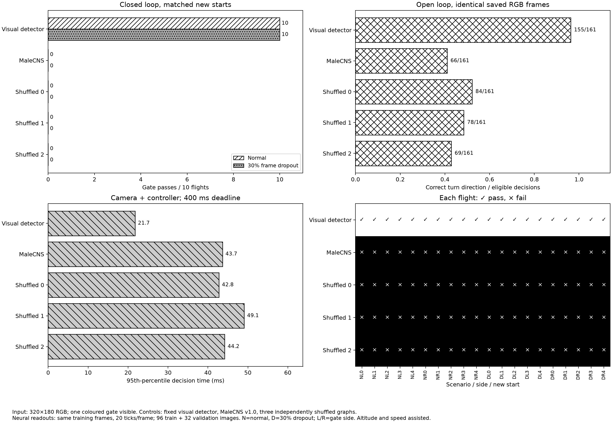

# Issue #2: сравнение управления по RGB-кадрам FPV

**Дата:** 26 сентября 2026 года. **Итог опыта:** для проверенного 2D кодировщика и 18-группового считывания исходный граф MaleCNS не показал преимущества над визуальным контроллером или тремя перемешанными графами. В 20 новых полётах визуальный контроллер прошёл все ворота, каждый нейронный вариант — ни одни. Это отрицательный результат данной реализации; оптическая калибровка входа и работа на сложном видео остаются открытыми.



[Векторная версия](infographic.svg) · [код построения из `results.json`](../../scripts/plot_raw_fpv.py)

## Источники и состав модели

- [Официальная выгрузка MaleCNS v1.0](https://male-cns.janelia.org/download/) — первичный источник аннотаций и графа связей. В опыте загружена фиксированная производная модель `flybrain==0.1.0`; SHA-256 `brain.npz`: `cc9bd1ecd00bd703a6fa648bc6ad145c93c7c1ee53debdcc9ce0d1f4305e6aca`, `weights.npz`: `c29919aa44069a271b1ee978abe05fa9bf6e45e4ba3e436e92b624ef1b5be40c`.
- [Таблица колонок обоих глаз MaleCNS v1.0](https://github.com/flyconnectome/2025malecns/blob/67767d2233657983993ff6c2be48e836a935863c/supplemental_data/optic-column-type-assignments-v1.0.xlsx) содержит L1/R7/R8 для колонок. [Предыдущий отчёт](../retina-2d/report.md) описывает нашу 2D проекцию, её косвенные координаты R1–R6 и 141 рецептор без координат. SHA-256 использованной [карты](../retina-2d/map.npz): `a224fe3afb3fa99ee2f4080ad7bf909b3788e787ffc613ce8dea874a71b000f8`. Координаты не являются измеренной оптической калибровкой FPV-камеры.
- [Исходный код `flybrain`](https://github.com/alextitonis/fly.ai) описывает преобразование MaleCNS в фиксированную спайковую модель. Динамика модели и вход `eye_drive` — реализация `flybrain`, а не запись физиологического ответа живой мухи.

## Протокол

[Код опыта](../../scripts/benchmark_raw_fpv.py) использует MuJoCo 3.14.0, одну 320×180 RGB FPV-камеру и модель квадрокоптера с внешним удержанием высоты и скорости. Для однозначной зрительной задачи в сцене видна только целевая цветная рамка; в [прежнем benchmark](../vision-benchmark/report.md) обе рамки были видны, а нейронный контроллер получал заранее вычисленный угол. В новом опыте нейронному контроллеру передаётся **только RGB-массив или маркер пропуска кадра**. Цветовой детектор отключён во время его полёта. Обычный визуальный контроль выделяет цветную рамку, вычисляет угол и подаёт пропорциональную команду рыскания. Общий срок решения — 400 мс; число операций разное, срок в офлайн-симуляции измеряется, но не задерживает команду.

По 96 обучающим и 32 отдельным проверочным статическим кадрам случайных поз и направлений обучалось только линейное ridge-считывание. Учебная метка — команда по **истинному углу из состояния симулятора**; на проверке и в полёте этот угол нейронному контроллеру не передаётся. Разделение задаётся зернами 71 и 100071. Каждый нейронный вариант получает одинаковые кадры, метки и 20 тактов спайковой модели на кадр. Входом служит яркость RGB, спроецированная по исследовательской 2D карте на 6006 фоторецепторов. Признаки — число спайков 16 двусторонних групп T4/T5 и двух групп DNa02. Исходный граф и три независимо перемешанных графа получают разные записи считывания после одинакового объёма обучения; перемешивание сохраняет число исходящих рёбер каждого нейрона и глобальное мультимножество адресатов, но разрушает соответствие конкретных клеток. Хеши графов, признаки и предсказания сохранены.

Новые старты: зерно 200071, пять поз на каждую сторону рамки и два сценария — обычный и независимый 30% пропуск измерений: 20 полётов на контроллер. Начальные позы и зерна пропусков совпадают в паре. В открытом контуре все варианты последовательно видят **точные RGB-кадры эталонного визуального полёта** и те же маркеры пропуска; в замкнутом контуре после первого кадра траектории и кадры закономерно различаются. Метрика направления учитывает решения с истинным модулем угла не менее 0,08 рад. Пропущенный кадр заставляет нейронный контроллер повторить последнюю команду, а визуальный — последний измеренный угол. [Массив обучающих и проверочных кадров](corpus_frames.npz) · [массив кадров открытого контура и масок пропусков](open_loop_frames.npz) · [полные решения, трассы, признаки и метрики](results.json) · [аудит хешей и парности](audit.json) · [код аудита](../../scripts/audit_raw_fpv.py).

## Результаты

| Контроллер | Ворота, обычный режим | Ворота, 30% пропусков | Знак поворота на одинаковых кадрах | 95-й процентиль решения, мс | Пропуски срока 400 мс |
| --- | ---: | ---: | ---: | ---: | ---: |
| Цветовой визуальный детектор | 10/10 | 10/10 | 155/161 | 21,7 | 0 |
| Исходный MaleCNS | 0/10 | 0/10 | 66/161 | 43,7 | 0 |
| Перемешанный граф 0 | 0/10 | 0/10 | 84/161 | 42,8 | 0 |
| Перемешанный граф 1 | 0/10 | 0/10 | 78/161 | 49,1 | 0 |
| Перемешанный граф 2 | 0/10 | 0/10 | 69/161 | 44,2 | 0 |

На отдельной проверочной выборке метка направления была ненулевой в 30/32 кадрах: исходный граф дал **18/30** верных знаков, перемешанные — **16/30**, **16/30**, **17/30**. Среди 96 учебных кадров средняя активность DNa02 была меньше 0,23 спайка за 20 тактов на любую сторону у всех графов. В исходном графе DNa02 слева и справа дали соответственно 0,052 и 0,063 спайка в среднем. T4/T5 отвечали, но выбранное агрегированное считывание не извлекло надёжное направление цели. 20/20 неудачных полётов исходного графа завершились по 14-секундному тайм-ауту; у одного перемешанного варианта были три пересечения плоскости вне рамки, остальные его полёты также закончились тайм-аутом. Распределение всех новых стартов показано в инфографике, а причины завершения и траектории — в `results.json`.

[Аудит](audit.json) пересчитал SHA-256 всех 128 кадров настройки, 244 доступных кадра открытого контура и совпадение 33 маркеров пропуска; проверил совпадение первого кадра и начальной позы во всех парах и различие хешей четырёх графов. Полные учебные примеры, веса считываний (`*_readout.npz`), предсказания, решения и траектории сохранены. Задержки относятся к этой машине и этому запуску; их нельзя переносить на реальный бортовой компьютер.

## Интерпретация и остающаяся проверка

**Наблюдение:** визуальный контроллер решал эту простую цветную задачу, тогда как все четыре нейронных варианта не прошли ни одной рамки. Исходный граф не превосходил перемешанные на открытом контуре: его 66/161 верных направлений меньше результатов каждого из трёх контролей. Это не доказывает, что граф вообще не способен обрабатывать видео; проверен один кодировщик, один набор 18 признаков, статические учебные примеры и короткое окно в 20 тактов. Переход от независимых учебных кадров со сбросом состояния сети к непрерывным полётным кадрам также может снижать качество; временно согласованное обучение на отдельных траекториях здесь не проводилось.

**Ограничение источника:** как показал [issue #1](https://github.com/hldrnwnv/fly-drone/issues/1), карта колонок ещё не задаёт ориентацию и углы оптических осей обоих глаз; устойчивый направленный ответ T4/T5 на контролях движения в этой модели не подтверждён. Поэтому условие issue #2 о *валидированном* зрительном входе для нейронного сравнения полностью не выполнено. Следующая проверка — откалибровать проекцию на независимом зрительном наборе, обучать считывание на разделённых по траектории последовательностях и затем повторить парный открытый и замкнутый контур на новых сценах и стартах. До неё issue #2 остаётся открытым. Физиологическую функцию T4/T5 или причинный нейронный путь к DNa02 опыт не устанавливает.

## Повторение

Из корня репозитория после установки `.[fpv,research]` и сборки карты из issue #1:

```sh
FLY_DATA="$PWD/data/flybrain" .venv/bin/python scripts/benchmark_raw_fpv.py --output runs/raw-fpv --train-count 96 --validation-count 32 --eval-seeds 5 --ticks 20
.venv/bin/python scripts/audit_raw_fpv.py --run-dir runs/raw-fpv
.venv/bin/python scripts/plot_raw_fpv.py --run-dir runs/raw-fpv
.venv/bin/python -m unittest discover -s tests -v
```
