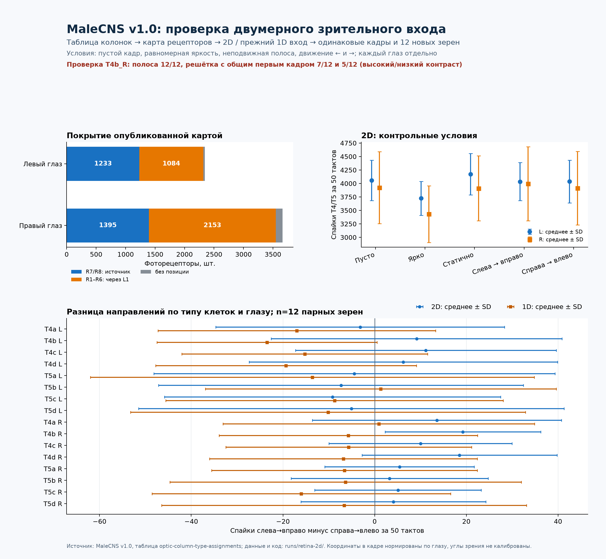

# Issue #1: двумерный зрительный вход и направление движения

**Результат проверки: устойчивой направленной избирательности не подтверждено.** Для MaleCNS v1.0 найдены опубликованные двумерные *координаты колонок* обоих глаз. Они позволяют задать проверяемую 2D топологию входа, но не дают углов оптических осей всех фоторецепторов и не калибруют ориентацию FPV-камеры. Слабая асимметрия T4b правого глаза возникла на движущейся полосе, но не воспроизвелась на движущейся решётке с одинаковым начальным кадром. `DNa02` практически не отвечали. Заявленная исследовательская проверка issue #1 завершена с отрицательным выводом; успешный полёт по-прежнему не является доказательством обработки оптического потока коннектомом.



[Векторная версия инфографики](infographic.svg) · [код построения](../../scripts/plot_retina_2d.py)

## Источники и граница данных

- [Портал MaleCNS](https://male-cns.janelia.org/download/) описывает релиз `male-cns:v1.0`, нейронные аннотации, граф связей и координаты в EM-пространстве.
- [Сопроводительный репозиторий MaleCNS](https://github.com/flyconnectome/2025malecns/blob/67767d2233657983993ff6c2be48e836a935863c/README.md#optic-lobe-column-assignment) описывает [таблицу колонок обоих глаз](https://github.com/flyconnectome/2025malecns/blob/67767d2233657983993ff6c2be48e836a935863c/supplemental_data/optic-column-type-assignments-v1.0.xlsx): идентификаторы L1, R7 и R8 и тип колонки. SHA-256 локальной копии: `d4af1cacb751036f7e84bfecc9bec79ca010066ac066559c29b566003ec080d3`.
- [Документация Reiser Lab о координатах](https://github.com/reiserlab/male-drosophila-visual-system-connectome-code/blob/main/docs/coordinate-systems.md) задаёт `hex1/hex2` и их связь с осями `p/q`, горизонталью и вертикалью карты. Мы использовали `x ∝ hex1 − hex2`, `y ∝ −(hex1 + hex2)` и нормировали их **отдельно для каждого глаза**. Это выбор проекции на искусственный кадр, а не измеренная угловая калибровка.
- [Код сборки `flybrain`](https://github.com/alextitonis/fly.ai/blob/main/flybrain/build.py) показывает, как из MaleCNS v1.0 получается сохранённый граф и одномерный `azimuth`. Здесь применена установленная версия `flybrain==0.1.0`; в 1D контроле использован её уже сохранённый `azimuth`.
- [Первичная работа по зрительной карте](https://pmc.ncbi.nlm.nih.gov/articles/PMC12119369/) связывает колонки медуллы с шестигранной решёткой глаза. Она не превращает координаты колонок в откалиброванные углы FPV-камеры.

В локальном `brain.npz` — 6006 рецепторов: 3377 `R1-6`, 1300 `R7`, 1329 `R8`. В таблице напрямую нашлись 2628 `R7/R8` (1233 слева, 1395 справа). Для 3237 `R1-6` выбрана колонка опубликованного L1 с самым сильным входом от этого рецептора **в нормированном графе `flybrain`** и с той же стороной; при разнице двух лучших кандидатов не более 5% позиция не назначалась. Это **вывод по связи**, не исходная координата самого `R1-6`. Ещё 141 рецептор (28 слева, 113 справа) остался без позиции и во всех 2D кадрах получает постоянный фон. [Карта, её источники и происхождение каждой строки](map.json) · [массив карты](map.npz) · [код построения](../../scripts/build_retina_map.py).

SHA-256 локальных файлов модели: `brain.npz` — `cc9bd1ecd00bd703a6fa648bc6ad145c93c7c1ee53debdcc9ce0d1f4305e6aca`; `weights.npz` — `c29919aa44069a271b1ee978abe05fa9bf6e45e4ba3e436e92b624ef1b5be40c`.

## Протокол

Один и тот же набор RGB-кадров 64×64 показывали двум способам кодирования: новая 2D карта колонок и прежняя 1D проекция. Каждый глаз возбуждали отдельно; другой получал постоянный фон. Контроли: пустой кадр, равномерный светлый кадр, неподвижная светлая полоса и та же полоса в двух противоположных порядках движения. Полоса занимала центральную половину кадра по вертикали. Каждый опыт: сброс сети с тем же зерном шума, 10 тактов пустого фона, затем 50 кадров по одному такту 20 мс. Использованы **новые зерна 19–30**, не 7–18 из прежней пробы: 2 кодирования × 2 глаза × 5 условий × 12 зерен = 240 опытов и 12 000 наблюдаемых тактов. Граф, динамика и остальные параметры не обучались.

[Код опыта](../../scripts/probe_retina_motion_2d.py) · [точные кадры](stimulus_frames.npz) · [20 последовательностей рецепторного входа](inputs.npz) · [спайки T4/T5 и всех размеченных нисходящих клеток по тактам](spikes.npz) · [счётчики по каждому опыту](results.json). Индексы спайков в `spikes.npz` связаны с телами нейронов и тактами через `observed_body_ids` и `tick_offsets`; для каждого опыта `first_tick` записан в JSON. Маленький массив исходных кадров включён в Git отдельным исключением `.gitignore`.

Из-за положительной разницы у `T4b_R` проведён дополнительный **контроль с фазой**: синусоидальная решётка из четырёх пространственных периодов двигалась в противоположных направлениях за 50 кадров. Оба направления начинались одним кадром и содержали один и тот же набор кадров; изменялся лишь порядок. Проверены два контраста (амплитуда ±95 и ±40 вокруг яркости 125), неподвижный кадр каждого контраста, те же 2D/1D кодирования, оба глаза и зерна 19–30: **288 опытов и 14 400 тактов**. [Код](../../scripts/probe_retina_grating.py) · [точные кадры](grating/stimulus_frames.npz) · [входы](grating/inputs.npz) · [спайки](grating/spikes.npz) · [результаты](grating/results.json). Счётчики исходных 240 и дополнительных 288 опытов сверены с сохранёнными спайками [проверочным скриптом](../../scripts/audit_retina_receipts.py).

Запуск из корня проекта после установки `.[research]`:

```sh
FLY_DATA="$PWD/data/flybrain" .venv/bin/python scripts/build_retina_map.py
FLY_DATA="$PWD/data/flybrain" .venv/bin/python scripts/probe_retina_motion_2d.py
FLY_DATA="$PWD/data/flybrain" .venv/bin/python scripts/probe_retina_grating.py
.venv/bin/python scripts/audit_retina_receipts.py
.venv/bin/python scripts/audit_retina_receipts.py --run-dir runs/retina-2d/grating
.venv/bin/python scripts/plot_retina_2d.py
```

## Наблюдения и интерпретация

Суммарно по T4/T5 своего глаза новая 2D карта дала в среднем **4035 против 4037** спайков для движения слева направо и справа налево слева; **3993 против 3914** справа. Стандартные отклонения по зернам составили 353–397 слева и 682–687 справа. У `T4b_R` парная разница `слева→вправо − справа→влево` для полосы была положительной на **12/12** зерен, в среднем **+19,2** спайка за 50 тактов. У `T4d_R` знак совпал в 10/12 зерен (+18,5 в среднем). Эти различия малы относительно сотен спайков каждой группы и не образуют убедительной картины разных предпочитаемых направлений для подтипов T4/T5. Прежний 1D вход на тех же кадрах не показал такого знака у `T4b_R` (4/12 положительных, −5,8 в среднем).

На **фазово согласованной решётке** разница `T4b_R` для 2D входа была положительной лишь в **7/12** опытах при высоком контрасте (среднее +1,6 спайка) и в **5/12** при низком (−2,8). Сходный знак на всех зернах для полосы не воспроизвёлся на другом стимуле. Это поддерживает узкий вывод: модель меняет активность при изменении временного порядка изображения, но устойчивой направленной избирательности T4/T5 в заявленных условиях не показала.

Для 2D входа все размеченные нисходящие клетки **своего** глаза дали в среднем 696,5 против 712,4 спайка слева и 697,2 против 705,2 справа; `DNa02` — менее одного спайка в среднем на опыт при обоих направлениях. Нет подтверждения, что направленная асимметрия T4/T5 дошла до прежнего моторного считывания. Сравнение с неподвижной полосой и равномерной яркостью также показывает, что общая активность существенно зависит от освещённости и фонового шумового режима; одного изменения числа спайков недостаточно для вывода о детекции движения.

**Граница вывода:** угловая оптика каждого глаза, привязка FPV-камеры, точные координаты `R1-6` и 141 непоставленного рецептора не содержатся в использованной таблице. Эти величины не были придуманы. Проверка других скоростей и биофизики модели может быть отдельным исследованием; результат данного issue — отсутствие подтверждённой направленной избирательности у построенного входа, а не утверждение, что живые T4/T5 её не имеют.
