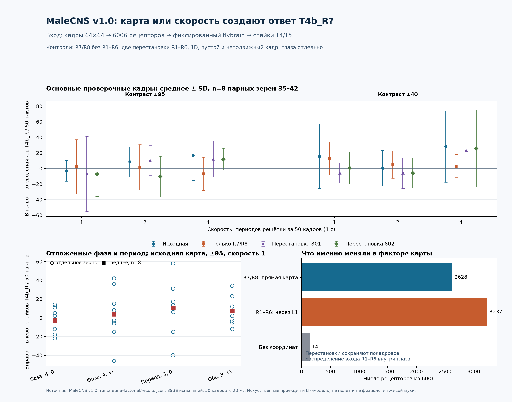

# Issue #8: карта R1–R6, скорость и ответ T4/T5

**Результат: устойчивый направленный ответ модели не найден.** На новых зернах `35–42` максимальный заранее интересовавший эффект `T4b_R` для исходной карты в основном наборе составил `+17,1` спайка за 50 тактов при высоком контрасте и скорости 4, но знак был положительным только в 7/8 пар. При изменении одной лишь начальной фазы среднее стало `−4,4`, одного лишь пространственного периода `−0,2`, обоих факторов `−8,9`. Ни одно условие не выполнило заранее записанный критерий устойчивости. Эти результаты описывают `flybrain` на синтетических кадрах; они не измеряют зрение живой мухи и не показывают управление квадрокоптером по оптическому потоку.



[Векторная инфографика](infographic.svg) · [код построения](../../scripts/plot_retina_factors.py) · [все парные разности и входные статистики](results.json) · [таблица всех клеточных групп](group_summary.csv)

## Источники и область проверки

- [Официальный релиз MaleCNS v1.0](https://male-cns.janelia.org/download/) — исходный набор для локальных `brain.npz` и `weights.npz`; [репозиторий авторов](https://github.com/flyconnectome/2025malecns/blob/67767d2233657983993ff6c2be48e836a935863c/README.md#optic-lobe-column-assignment) описывает таблицу колонок обоих глаз с `L1`, `R7`, `R8`. Он не публикует использованные здесь прямые позиции каждого `R1–R6`.
- [Документация координат Reiser Lab](https://github.com/reiserlab/male-drosophila-visual-system-connectome-code/blob/main/docs/coordinate-systems.md) объясняет оси `hex1/hex2`. Преобразование в нормированные координаты искусственного кадра и выбор сильнейшей связи `R1–R6 → L1` — **наши инженерные решения**, описанные в [предыдущем отчёте](../retina-2d/report.md) и [карте с происхождением строк](../retina-2d/map.json). Углы зрения и ориентация FPV-камеры не калиброваны.
- [Код `flybrain`](https://github.com/alextitonis/fly.ai/blob/main/flybrain/build.py) преобразует MaleCNS в применённый здесь граф. `flybrain==0.1.0` — упрощённая спайковая модель; её ответы на ввод тока не равны физиологическим измерениям.

Хеши SHA-256 локальных файлов: `map.npz` — `a224fe3afb3fa99ee2f4080ad7bf909b3788e787ffc613ce8dea874a71b000f8`; `brain.npz` — `cc9bd1ecd00bd703a6fa648bc6ad145c93c7c1ee53debdcc9ce0d1f4305e6aca`; `weights.npz` — `c29919aa44069a271b1ee978abe05fa9bf6e45e4ba3e436e92b624ef1b5be40c`; первичная таблица `optic-columns.xlsx` — `d4af1cacb751036f7e84bfecc9bec79ca010066ac066559c29b566003ec080d3`. Хеши протокола и кода также находятся в [`results.json`](results.json).

## Зафиксированный метод

[Протокол](protocol.md) записан до анализа новых результатов. Основной стимул — решётка из четырёх пространственных периодов в кадре 64×64, фаза 0, контраст ±95 или ±40 вокруг яркости 125. За 50 кадров по 20 мс она проходит 1, 2 или 4 периода. Два направления в паре начинают одним кадром и имеют одно мультимножество кадров. Базовая скорость 1 побайтно совпала с прежним [контролем решётки](../retina-2d/grating/stimulus_frames.npz). Каждый опыт начинается со сброса сети с тем же зерном и 10 тактов пустого фона. Глаза стимулируются по отдельности.

Фактор карты имеет четыре варианта: исходная 2D карта; только прямо размещённые `R7/R8`; две перестановки координат **только** косвенно размещённых `R1–R6` внутри глаза с заранее выбранными зернами перестановки `801` и `802`. Прямые координаты остаются на месте. Аудит подтвердил, что обе перестановки сохраняют точное мультимножество входных значений `R1–R6` в каждом кадре, а не только среднюю яркость. Вариант с одними `R7/R8` меняет число активных рецепторов и поэтому служит контролем наличия входа, а не чистой проверкой топологии. Старый 1D проектор — отдельный контроль на основном стимуле с высоким контрастом.

Зерна `31–34` — исследовательские, `35–42` — новые проверочные; настройки по первым четырём не менялись. Проверочные зерна получили основной стимул и три заранее указанных варианта: фаза 0,25 при четырёх периодах; три периода при фазе 0; оба изменения вместе. Пустой фон и неподвижная решётка проверены на этих же зернах. Всего **3936 испытаний × 50 кадров = 196800 тактов фильма**, плюс 10 фоновых тактов на испытание. [Сохранённые кадры](frames.npz) и [кадры дополнительных проверок](extension/frames.npz), [варианты карты](maps.npz), [входы для исследовательских зерен](discovery_inputs.npz), [входы для проверочных зерен](held_out_inputs.npz), [входы отложенных вариантов](extension/extension_inputs.npz), `seed_*.json` и `seed_*_spikes.npz` здесь и в `extension/` позволяют восстановить каждую пару. `input_key` связывает испытание с 50×6006 входными значениями, `first_tick` — со спайками по тактам.

## Наблюдения

Парная разность ниже означает число спайков при движении вправо **минус** движение влево за 50 тактов. В скобках — число положительных разностей из восьми проверочных зерен. Для `T4b_R` при исходной карте:

| Контраст | Скорость, периодов/с | Основные кадры, спайки (положительных зерен) | Перестановка 801 | Перестановка 802 |
| --- | ---: | ---: | ---: | ---: |
| ±95 | 1 | −2,9 (4/8) | −7,0 (5/8) | −7,2 (3/8) |
| ±95 | 2 | +8,5 (5/8) | +10,2 (6/8) | −10,4 (2/8) |
| ±95 | 4 | +17,1 (7/8) | +12,2 (5/8) | +12,0 (7/8) |
| ±40 | 1 | +15,6 (5/8) | −5,8 (2/8) | +0,6 (5/8) |
| ±40 | 2 | +0,4 (4/8) | −5,9 (4/8) | −5,9 (4/8) |
| ±40 | 4 | +28,2 (5/8) | +23,2 (3/8) | +25,6 (5/8) |

Даже при скорости 4 и контрасте ±95, где основная средняя разность наибольшая при хорошем согласии знака, проверка на тех же восьми зернах меняет вывод:

| Периоды, фаза | Средняя разность `T4b_R`, спайков/50 тактов | Положительных зерен |
| --- | ---: | ---: |
| 4, 0 — основная | +17,1 | 7/8 |
| 4, 0,25 — только фаза | −4,4 | 5/8 |
| 3, 0 — только период | −0,2 | 4/8 |
| 3, 0,25 — оба | −8,9 | 3/8 |

Для базовой скорости 1 при ±95 прежний набор зерен `19–30` давал `+1,58` и 7/12 положительных пар на решётке; новые исследовательские `31–34` дали `−21,75` и 0/4, проверочные `35–42` — `−2,88` и 4/8. Это сравнение разных зерен при идентичных кадрах; оно подтверждает нестабильность узкого эффекта в выбранной модели. У `T5b_L` при скорости 4 и контрасте ±40 основное условие дало отрицательный знак в 8/8 пар, но при одной лишь смене фазы среднее стало `+18,25` (5/8 положительных). По всем группам есть [полная таблица](group_summary.csv) и [отдельные разности каждого зерна](results.json).

Контроль количества входа: для правого глаза в основном движении при ±95 и скорости 1 исходная карта и обе перестановки дали одинаковую среднюю нормированную подачу `0,33773` на все 6006 рецепторов и 3548 рецепторов с входом, отличным от фона хотя бы в одном кадре. Вариант только R7/R8 дал `0,20418` и 1395 таких рецепторов. Эти числа не позволяют приписывать отличие варианта R7/R8 одной перестройке связности. При пустом фоне `T4b_R` дала в среднем `516,4` спайка за 50 тактов, при неподвижной решётке ±95 — `430,8` на основном правоглазом стимуле; наличие спайков или их изменение относительно фона само по себе не является направленным ответом.

Старый 1D контроль при ±95 в правом глазу дал средние разности `−3,75`, `−26,63`, `+0,13` спайка при скоростях 1, 2, 4 (положительный знак в 3/8, 1/8, 3/8). В исходной 2D карте парная разность `DNa02` своего глаза была ненулевой лишь в 19 из 384 проверочных сравнений всех четырёх блоков, двух глаз, двух контрастов и трёх скоростей; модуль разности никогда не превышал **один спайк**. Полезная передача этого синтетического сигнала на выбранный нисходящий считыватель не обнаружена.

## Вывод и ограничения

В испытанных условиях не выполнена гипотеза о воспроизводимой направленной разнице, которая зависит от исходной косвенной карты и сохраняется при новых фазах и периодах. Скорость заметно меняет средние разности в отдельных условиях, но знак и величина не переносятся на отложенные кадры; две перестановки часто дают сравнимые разности. Поэтому данные **не локализуют** стабильный эффект отдельно в карте или темпе. При смене числа пространственных периодов временная частота остаётся той же, но линейная скорость сдвига в пикселях/с меняется; этот контроль проверяет перенос между пространственными масштабами, а не изолированное действие периода при постоянной линейной скорости. Это отрицательный результат для выбранных скоростей, контрастов, координат, шума и LIF-динамики. Он не исключает другой зрительный интерфейс или физиологическую избирательность T4/T5 у живой мухи.

Воспроизведение из корня репозитория после установки `.[research]` и с исходными файлами в `data/flybrain/`:

```sh
for seed in {31..42}; do FLY_DATA="$PWD/data/flybrain" .venv/bin/python scripts/probe_retina_factors.py --seed "$seed"; done
for seed in {35..42}; do FLY_DATA="$PWD/data/flybrain" .venv/bin/python scripts/probe_retina_factors.py --extension --output runs/retina-factorial/extension --seed "$seed"; done
.venv/bin/python scripts/audit_retina_factors.py
.venv/bin/python scripts/plot_retina_factors.py
```

Скрипт не перезаписывает существующие `seed_*.json` и `seed_*_spikes.npz`; для полного повтора следует выбрать новый пустой `--output` для основного и дополнительного запуска, а затем передать его аудитору и построителю графика. Аудит проверил все **3936 испытаний**, входы, покадровое равенство мультимножеств и счётчики по спайкам; результат успешной сверки сам по себе не добавляет биологической валидности.
